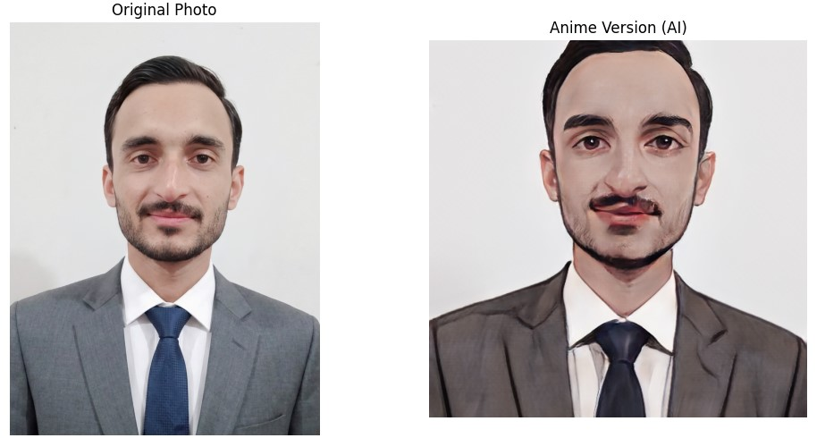

# 🎨 Anime Style Transfer (GANs)

This project uses **Deep Learning (Generative Adversarial Networks)** to transform real human faces into high-quality Anime characters. It utilizes the **AnimeGANv2** architecture with PyTorch.

## 🌟 Results (Original Version VS Anime Version )
Here is a sample result generated by the model:




## 🚀 How It Works
1.  **Input:** Takes a real-world photo (Selfie/Portrait).
2.  **Processing:** Passes it through a pre-trained **AnimeGANv2** Generator.
3.  **Output:** Generates a stylized anime version while preserving facial features.

## 🛠 Tech Stack
* **Language:** Python 🐍
* **Library:** PyTorch, Torchvision
* **Model:** AnimeGANv2 (Pre-trained)
* **Platform:** Google Colab (T4 GPU)

## 💻 How to Run
1.  Clone the repository.
2.  Install dependencies:
    ```bash
    pip install torch torchvision pillow matplotlib
    ```
3.  Run the script:
    ```bash
    python anime_converter.py
    ```

---
*Developed by [Mohammad Owais]*
